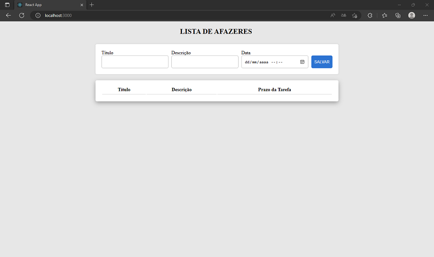

# Sumário

* [Front-end](https://github.com/RonielNunes/ListaDeAfazeres/blob/main/README.md#Front-end)
* [Back-end](https://github.com/RonielNunes/ListaDeAfazeres/blob/main/README.md#Back-end)
* [Como rodar a aplicação](https://github.com/RonielNunes/ListaDeAfazeres/blob/main/README.md#Back-end)

# **Front-end**

O front-end dessa aplicação é uma lista de afazeres interativa, responsável por exibir e gerenciar as tarefas a serem realizadas. A aplicação é compostar por elementos como botões  e campos de textos, que permitem de *inserir inforamções*, *editar*, *deletar* e *salvar*. 

- Tecnologias utilizadas no front-end
    - React
        - Linguagem JavaScript
        - Html e Css
    - Material UI

> Imagem ilustrativa 1.

<video width="861" height="511" controls>
  <source src="readme\using.mkv" type="video/ogg">
</video>

# **Back-end**

O back-end dessa aplicação tem como objetivo realizar o gerencimanto das tarefas requisitadas do front-end.

- Tecnologias utilizadas no back-end:
    - Postman(Teste de comunicação)
    - Xampp (gerenciador do banco de dados), Apache e MySql
    - Linguagem de programação Java
    - Spring boot:
        - Spring Data JPA SQL: Persist data in SQL stores with Java Persistence API using Spring Data and Hibernate.
        - Spring Web WEB: Build web, including RESTful, applications using Spring MVC. Uses Apache Tomcat as the default embedded container.
        - Lombok DEVELOPER TOOLS: Java annotation library which helps to reduce boilerplate code.

# **Como rodar a aplicação**

1. Inicie o *XAMPP*
    - *Apache* e *Mysql*
    - Acesse o MySql cliacando em *Admin* e crir um banco nomeado-o de *mydatabase*

2. Execute o *back-end* (qualquer IDE com java JDK 19 instalado)

3. Execute o *front-end*
    - `npm start`